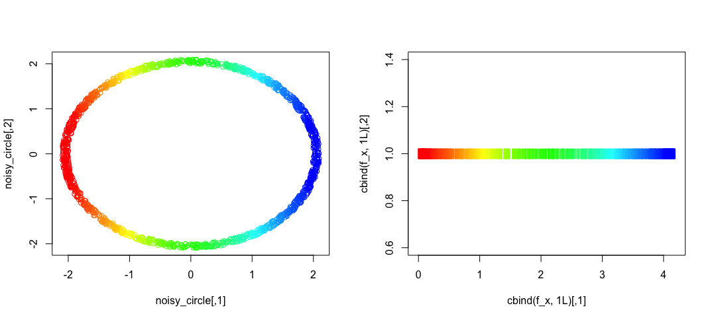

# Mapper 
[](https://ci.appveyor.com/project/peekxc/mapper)
[](https://travis-ci.com/peekxc/Mapper)
[](https://travis-ci.com/peekxc/Mapper)

This package provides a set of tools written in R/Rcpp for computing the _mapper_ construction, and other related algorithms. Mapper was originally introduced in the article 

> Singh, Gurjeet, Facundo Mémoli, and Gunnar E. Carlsson. "Topological methods for the analysis of high dimensional data sets and 3d object recognition." SPBG. 2007.

## Installation 

The current development version can be installed with the [devtools](https://github.com/r-lib/devtools) package: 
```R
require("devtools")
devtools::install_gitub("peekxc/mapper")
```

A stable CRAN release is planned for the future. 

## Usage

Given a data set, define the filter function. Here is an example using the noisy points sampled from the perimeter of a circle, similar to the example given by Example 3.2 in the original paper.   
```R
## Load the circle data set 
data("noisy_circle", package = "Mapper")

## Define filter values equal to the distance from each point to the left-most point in the circle 
left_pt <- noisy_circle[which.min(noisy_circle[, 1]),]
f_x <- matrix(apply(noisy_circle, 1, function(pt) (pt - left_pt)[1]))
```

Visualize the data and the results of the map
```R
layout(matrix(1:2, nrow=1))
rbw <- rainbow(100, start=0,end=4/6)[cut(f_x, breaks=99, labels=FALSE)]
plot(noisy_circle, col = rbw)
plot(cbind(f_x, 1L), pch = "|", col = rbw)
```

You can construct a _mapper_ with [R6 method chaining](https://adv-r.hadley.nz/r6.html#method-chaining)
```R
## Define the main via chaining R6 methods
m <- MapperRef$new(noisy_circle)$
  use_cover(filter_values = matrix(f_x), type="fixed rectangular", number_intervals=5L, percent_overlap=20)$
  use_clustering_algorithm(cl = "single", num_bins = 10)$
  use_distance_measure(measure = "euclidean")$
  compute_k_skeleton(k=1L)
m
```

```R
Mapper construction for 1500 objects
Cover: (typename = Fixed Rectangular, number intervals = [5], percent overlap = [20]%)
```

The _mapper_ is stored in a [simplex tree](https://hal.inria.fr/hal-00707901v1/document). To get a quick overview of what the complex looks like use
```R
print(m$simplicial_complex) 
```
```R
Simplex Tree with (8, 8) (0, 1)-simplices
```

Or print out the full trie structure
```R
m$simplicial_complex$print_tree() 
```
```R
0 (h = 1): .( 1 2 )
1 (h = 1): .( 3 )
2 (h = 1): .( 4 )
3 (h = 1): .( 6 )
4 (h = 1): .( 5 )
5 (h = 1): .( 7 )
6 (h = 1): .( 7 )
7 (h = 0): 
```

You can export to your favorite graph-based representation. 
```R
## Export to graph
m$simplicial_complex$as_adjacency_matrix()
# ...or m$simplicial_complex$as_adjacency_list()
# ...or m$simplicial_complex$as_edge_list()
```

The vertices of the _mapper_ are stored as a simple list 
```R
View(m$vertices)
```

To interactive with the graph, consider the [grapher](https://github.com/peekxc/grapher) library, ported from Ayasdis [grapher.js](https://github.com/ayasdi/grapher) library. 
```R
library("grapher")
m$as_grapher() 
```

## Additional Information 

More comprehensive documentation is available [here](https://peekxc.github.io/mapper/).
There's also a [vignette on using the package](https://peekxc.github.io/Mapper/articles/Mapper.html) that is more-depth.

