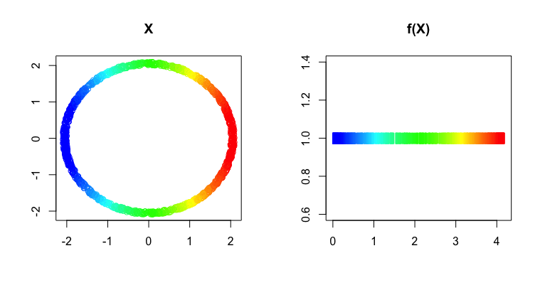

# Mapper 
[](https://ci.appveyor.com/project/peekxc/mapper)
[](https://travis-ci.com/peekxc/Mapper)
[](https://travis-ci.com/peekxc/Mapper)

This package provides a set of tools written in R/Rcpp for computing the _mapper_ construction, and other related algorithms. Mapper was originally introduced in the article 

> Singh, Gurjeet, Facundo Mémoli, and Gunnar E. Carlsson. "Topological methods for the analysis of high dimensional data sets and 3d object recognition." SPBG. 2007.

## Installation 

The current development version can be installed with the [devtools](https://github.com/r-lib/devtools) package: 
```R
require("devtools")
devtools::install_gitub("peekxc/mapper")
```

A stable CRAN release is planned for the future. 

## Usage

Given a data set, the first step to Mapper is to define a filter function. Here is an example using the noisy points sampled from the perimeter of a circle, similar to the example given by Example 3.2 in the original paper.   
```R
## Load package + the circle data set 
library("Mapper")
data("noisy_circle", package = "Mapper")

## Define filter values equal to the distance from each point to the left-most point in the circle 
left_pt <- noisy_circle[which.min(noisy_circle[, 1]),]
f_x <- matrix(apply(noisy_circle, 1, function(pt) (pt - left_pt)[1]))
```

Visualize the data and the results of the map
```R
layout(matrix(1:2, nrow=1))
plot(noisy_circle, col = bin_color(f_x), main = "X", xlab = "", ylab = "")
plot(cbind(f_x, 1L), pch = "|", col = bin_color(f_x), main = "f(X)", xlab = "", ylab = "")
```


You can construct a _mapper_ with [R6 method chaining](https://adv-r.hadley.nz/r6.html#method-chaining)
```R
## Define the main via chaining R6 methods
m <- MapperRef$new(noisy_circle)$
  use_filter(filter = matrix(f_x))$
  use_cover(cover="fixed interval", number_intervals=5L, percent_overlap=20)$
  use_distance_measure(measure="euclidean")$
  construct_k_skeleton(k=1L)
print(m)
```

```R
Mapper construction with (8, 8) (0, 1)-simplices
Fixed Interval Cover: (number intervals = [5], percent overlap = [20]%)
```

The _mapper_ is stored in a [simplex tree](https://hal.inria.fr/hal-00707901v1/document). To get a quick overview of what the complex looks like use
```R
print(m$simplicial_complex) 
```
```R
Simplex Tree with (8, 8) (0, 1)-simplices
```

Or print out the full trie structure
```R
m$simplicial_complex$print_tree() 
```
```R
0 (h = 1): .( 1 2 )
1 (h = 1): .( 3 )
2 (h = 1): .( 4 )
3 (h = 1): .( 6 )
4 (h = 1): .( 5 )
5 (h = 1): .( 7 )
6 (h = 1): .( 7 )
7 (h = 0): 
```

You can export to your favorite graph-based representation. 
```R
## Export to graph
m$simplicial_complex$as_adjacency_matrix()
# ...or m$simplicial_complex$as_adjacency_list()
# ...or m$simplicial_complex$as_edge_list()
# ...or m$simplicial_complex$as_list() for higher-dimension complexes
```

The vertices of the _mapper_ are stored as a simple list 
```R
View(m$vertices)
```

To interact with the graph, consider using the [pixiplex](https://github.com/peekxc/pixiplex) library.
```R
library("pixiplex")
plot(m$as_pixiplex())
```


## Additional Information 

More comprehensive documentation is available [here](https://peekxc.github.io/Mapper/).
There's also a [vignette on using the package](https://peekxc.github.io/Mapper/articles/Mapper.html) that is more-depth.

