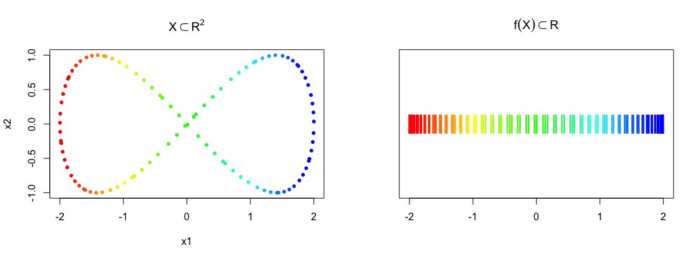

# R implementation of Mapper 
[](https://cran.r-project.org/packge=mapper)
[](https://ci.appveyor.com/project/peekxc/mapper)
[](https://travis-ci.com/peekxc/Mapper)
[](https://travis-ci.com/peekxc/Mapper)

```{r setup, eval=TRUE, include=FALSE}
library("Mapper")
```

The **Mapper** package provides an [R](https://www.r-project.org/) implementation of the Mapper framework (see [1](#mapper_paper)). The package includes: 


- Efficient implementation of Mappers components with [Rcpp](https://cran.r-project.org/web/packages/Rcpp/index.html)

- Pre-configured tools for visualizing and interacting with _mappers_

- Practical default settings for those unfamiliar with Mapper

- Composable API via [method chaining](https://adv-r.hadley.nz/r6.html#method-chaining) 

- Extendable [R6 generators](https://github.com/r-lib/R6) for Mappers components

The package is designed to make modifying or extending the Mapper method simple and efficient, without limiting its generality. 

### Getting started

#### Installation

Install the **Mapper** package from github as follows:

```{r, eval=FALSE}
require("devtools")
devtools::install_github("peekxc/mapper")
```

A CRAN release is planned for the near future. 

#### Creating a complex

Mapper takes as input a point cloud $X$ and a reference map $f : X \to Z$, and returns a topological summary of $X$ expressed via a cover equipped on the codomain of the map. 
Here's an example where points are sampled from an 'eight-curve' in $\mathbb{R}^2$: 

$$g(t) = [\cos(t), \sin(t)\cos(t)],\; t \in \Big(-\frac{1}{2}\pi, \frac{3}{2}\pi\Big)$$
In the example below, $X$ is created from equally spaced samples over $t$, and the map chosen is simply the $x$-coordinate of the shape, i.e. $f(X) = Z = x_1$.
```{r, echo=TRUE, fig.keep='none'}
t <- seq(-0.5*pi, (3/2)*pi, length.out = 100) + runif(100, max = 0.01)
eight <- cbind(x1=cos(t), x2=sin(t)*cos(t))
f_x <- matrix(cos(t))

## Use a rainbow palette 
rbw_col <- rainbow(length(f_x), start = 0, end = 4/6)
col <- rbw_col[cut(f_x, length(f_x), labels = FALSE)]

## View the data along with the mapping 
layout(matrix(1:2, nrow = 1))
plot(eight, pch = 20, col = col, main = expression(X %subset% R^2))
stripchart(f_x, pch = "|", main = expression(f(X) %subset% R)) 
points(cbind(f_x, 1), pch = "|", col = col, cex = 2)
```



Below is one possible way to construct a _mapper_. 
```{r, echo=TRUE, eval=TRUE}
m <- MapperRef$new(X = eight)$                                             
  use_cover(filter_values = f_x, typename = "fixed interval", 
            number_intervals = 5, percent_overlap = 20)$
  use_clustering_algorithm(cl = "single")$
  construct_k_skeleton(k = 1L)
print(m)
```

```R
Mapper construction for 100 objects
Cover: (typename = Restrained Rectangular, number intervals = [10], overlap = [50])
```

There are multiple options one may use to visualize __mapper__. The easiest is to export the $1$-skeleton to a mature graph plotting library, such as `igraph`:
```{r, eval=FALSE}
am <- m$simplicial_complex$as_adjacency_matrix()
g <- igraph::graph_from_adjacency_matrix(am, mode = "undirected", add.colnames = NA)
avg_filter_val <- sapply(m$vertices, function(idx) mean(f_x[idx,]))
plot(g, layout=igraph::layout_with_fr(g, niter = 5500),
     vertex.size = 18L, vertex.color = bin_color(avg_filter_val), label.cex = 0.3)
```

For other visualization options, see the section below. 

#### Customizing Mapper

Almost any component of the Mapper method can be customized. 

Want to change the metric? Pass the name of any proximity measure used in the [proxy](https://cran.r-project.org/web/packages/proxy/index.html) package.
```{r}
## See ?proxy::pr_DB for more details.
m$use_distance_measure("manhattan") ## This is stored as m$measure
```

Prefer a different linkage criteria to cluster over? Any of the criteria used by [hclust](https://stat.ethz.ch/R-manual/R-devel/library/stats/html/hclust.html) can be swapped in.
```{r}
m$use_clustering_algorithm(cl = "average", num_bins = 10L)
```

Or, just replace the clustering algorithm entirely
```{r, eval=TRUE, echo=TRUE, results='hide'}
## If using a custom metric, just compute the distance matrix 
m$use_clustering_algorithm(cl = function(X, idx, num_bins=10){
  dist_x <- dist(X[idx,], method = self$measure)
  hc <- hclust(dist_x, method = "average")
  cutoff_first_bin(hc, diam = max(dist_x), num_bins)
})
```

If you prefer a different covering, just assign a valid object inheriting from `CoverRef`. 
```{r}
m$use_cover(filter_values = f_x, 
            typename="restrained interval", 
            number_intervals = 10L, percent_overlap=50)
```

A list of available covering methods, their correspondings parameters, and their generators can be printed as follows: 
```{r}
covers_available()
```
Alternatively, you can create your own cover. See the article on [how to make custom cover](articles/UsingCustomCover.html). 

The cover is composed of subsets of the data indexed by an __index set__
```{r}
print(m$cover$index_set)
```
<!-- These indices naturally act as keys into the collection of sets comprising the cover -->
These indices can be used as keys into the collection of sets comprising the cover. 
```{r}
all(m$cover$index_set %in% names(m$cover$level_sets))
```

This can be useful if you want to only update only part of the complex for some reason, e.g. re-cluster part of the data with different clustering parameters. For example, to re-cluster the data associated with the preimages the first two indices, you can do:
```{r}
clustering_params <- list(num_bins=5L)
m$construct_nerve(which_levels = m$cover$index_set[1:2], clustering_params)
```

The same rule applies to computing the edges. 
```{r}
idx_pairs <- t(apply(combn(5, 2), 2, function(ls_idx) { m$cover$index_set[ls_idx] }))
m$compute_edges(which_level_pairs = idx_pairs)
```

If the construction has too many edges, you could require the intersection size be above a certain threshold (default is 1). This isn't technically part of Mappers definition, but could be useful in practical applications. 

```{r}
m$compute_edges(min_weight = 10)
```

The simplicial complex is available via the `$simplicial_complex` member, and the points in contained in each vertex is available via the `$vertices` member.

```{r}
m$simplicial_complex
head(m$vertices, 2)
```

The complex is stored in a [Simplex Tree](?simplex_tree) (see 2), and the vertices are stored as a list. Each vertex also has an attribute "level_set" denoting the index in the index set of the cover its associated with.  

The $1$-skeleton can be exported to any of the usual graph-type data structures.
```{r, eval=FALSE}
m$simplicial_complex$as_adjacency_matrix()
m$simplicial_complex$as_adjacency_list()
m$simplicial_complex$as_edge_list()
```

### Visualizing the __mapper__

To get a quick overview of what the graph looks like, you can convert to an [igraph](https://igraph.org/r/) object.
By default, the vertices are sized logarithmically according to how many points they have in them and colored based on the mean value of the points $f$ values. Each vertex is given a label of the form "x:y" where 'x' denotes the vertex id, and 'y' denotes the number of points in the vertex.  

```{r, eval = FALSE, echo = TRUE}
plot(m$as_igraph())
```


More more interactive plotting methods, the __mapper__ can be converted to a [grapher](https://github.com/peekxc/grapher) object.  
```{r, eval=FALSE, echo=TRUE}
## Visualize interactively w/ grapher
library("grapher")
m$as_grapher(construct_widget = TRUE) %>% center()
```


## References 
<a name="mapper_paper">1.</a> Singh, Gurjeet, Facundo Mémoli, and Gunnar E. Carlsson. "Topological methods for the analysis of high dimensional data sets and 3d object recognition." SPBG. 2007.

<a name="simplex_tree_paper">2.</a> Boissonnat, Jean-Daniel, and Clément Maria. "The simplex tree: An efficient data structure for general simplicial complexes." Algorithmica 70.3 (2014): 406-427.

<!-- TODO -->
<!-- Show rgl + grapher shiny example to better demonstrate the concept of the pullback  -->
<!-- ```{r} -->
<!-- # xyz <- replicate(3L, rnorm(5000)) -->
<!-- # sphere <- t(apply(xyz, 1, function(x) x/norm(matrix(x), type="F"))) -->
<!-- # filter_pts <- sphere[, c(3, 1)] -->
<!-- #  -->
<!-- # sphere_mapper <- MapperRef$ -->
<!-- #   new(sphere)$ -->
<!-- #   use_cover(filter_pts, "fixed rectangular", number_intervals = 6, percent_overlap = 0.15)$ -->
<!-- #   use_distance_measure(measure = "euclidean") -->
<!-- # sphere_mapper$clustering_algorithm <- function(X, idx){ -->
<!-- #   rep(1L, length(idx)) -->
<!-- # } -->
<!-- #  -->
<!-- # sphere_mapper$compute_k_skeleton(k = 1L) -->
<!-- ``` -->

<!-- # ```{r} -->
<!-- # data("chemdiab", package="locfit") -->
<!-- # colnames(chemdiab) <- c("RelativeWeight", "FastingPlasmaGlucose", "ToleranceTestAUC",  -->
<!-- #                         "InsulinCurveAUC", "SteadyStatePlasmaGlucoseResponse",  -->
<!-- #                         "DiabetesClassification") -->
<!-- #  -->
<!-- # chem_ica <- ica::icafast(chemdiab[, 1:5], nc = 3) -->
<!-- #  -->
<!-- # m <- MapperRef$ -->
<!-- #   new(X = as.matrix(chemdiab[, 1:5]))$                                              -->
<!-- #   use_cover(filter_values = chem_ica$S,  -->
<!-- #             type = "restrained rectangular",  -->
<!-- #             number_intervals = 5, percent_overlap = 0.35)$ -->
<!-- #   use_distance_measure(measure = "euclidean")$ -->
<!-- #   use_clustering_algorithm(cl = "single", num_bins = 5L)$ -->
<!-- #   compute_k_skeleton(k = 1L) -->
<!-- #  -->
<!-- #  -->
<!-- #  -->
<!-- # with(chemdiab, { -->
<!-- #   matchlevels(DiabetesClassification) -->
<!-- # }) -->
<!-- #  -->
<!-- # m$as_grapher() %>% setNodeColor(color = ) -->
<!-- # ``` -->


