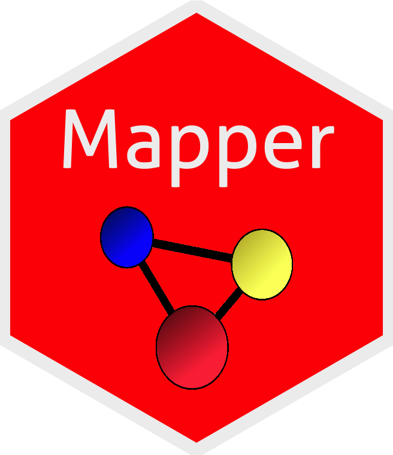

```{r, echo = FALSE}
knitr::opts_chunk$set(
  collapse = TRUE,
  comment = "#>"
)
```


# Mapper 


[](https://ci.appveyor.com/project/peekxc/mapper)
[](https://travis-ci.com/peekxc/Mapper)
[](https://travis-ci.com/peekxc/Mapper)
[](https://www.tidyverse.org/lifecycle/#maturing)

The `Mapper` package provides an [R](https://www.r-project.org/) implementation of the *Mapper* framework (see [1](#mapper_paper)). The package includes: 

- Efficient implementations of *Mapper* components using [Rcpp](https://cran.r-project.org/web/packages/Rcpp/index.html)

- Practical default filters, covers, and other settings for those unfamiliar with *Mapper*

- Composable API via [method chaining](https://adv-r.hadley.nz/r6.html#method-chaining) 

- Pre-configured tools for visualizing and interacting with _mappers_

The package is designed to make modifying or extending the *Mapper* method simple and efficient, _without_ limiting its generality. 

## Installation

Install the `Mapper` package from github as follows:

```{r, eval=FALSE}
require("devtools")
devtools::install_github("peekxc/mapper")
```

A CRAN release is planned for the near future. 

## Getting started

```{r setup, eval=TRUE, include=FALSE}
library("Mapper") #style="margin-left: 15px;"
```

*Mapper* takes as input a point cloud $X$ and a reference map $f : X \to Z$, and returns a topological summary of $X$ expressed via a cover equipped to the codomain of the map. 
For example, consider a point cloud sampled from an 'eight-curve' in $\mathbb{R}^2$: 

$$g(t) = [\cos(t), \sin(t)\cos(t)],\; t \in \Big(-\frac{1}{2}\pi, \frac{3}{2}\pi\Big)$$
In the example below, the data set $X$ is created from equally spaced samples over $t$, and the map chosen is simply the $x$-coordinate of the shape, i.e. $f(X) = Z = x_1$.
```{r, echo=TRUE, fig.keep='none'}
t <- seq(-0.5*pi, (3/2)*pi, length.out = 100) + runif(100, max = 0.01)
eight <- cbind(x1=cos(t), x2=sin(t)*cos(t))
f_x <- matrix(cos(t))

## Use a rainbow palette 
rbw_col <- rainbow(length(f_x), start = 0, end = 4/6)
col <- rbw_col[cut(f_x, length(f_x), labels = FALSE)]

## View the data along with the mapping 
layout(matrix(1:2, nrow = 1))
plot(eight, pch = 20, col = col, main = expression(X %subset% R^2))
stripchart(f_x, pch = "|", main = expression(f(X) %subset% R)) 
points(cbind(f_x, 1), pch = "|", col = col, cex = 2)
```


Below is a illustrative example of how one may go about constructing a _mapper_. 
```{r, echo=TRUE, eval=TRUE}
m <- MapperRef$new(X = eight)$
  use_filter(filter= f_x)$
  use_cover(cover = "fixed interval", number_intervals = 5, percent_overlap = 20)$
  use_clustering_algorithm(cl = "single")$
  construct_k_skeleton(k = 1L)
print(m)
```

There are multiple options one may use to visualize __mapper__. A default plotting method is available using an `igraph` determined layout:
```{r}
plot(m$simplicial_complex)
```

For other visualization options, see below. 

#### Customizing Mapper

Almost any component of the Mapper method can be customized. 

Want to change the metric? Pass the name of any proximity measure used in the [proxy](https://cran.r-project.org/web/packages/proxy/index.html) package.
```{r}
## See ?proxy::pr_DB for more details.
m$use_distance_measure("manhattan") ## This is stored as m$measure
```

Prefer a different [linkage criteria](https://en.wikipedia.org/wiki/Hierarchical_clustering#Linkage_criteria) to cluster with? Any of the criteria used by [hclust](https://stat.ethz.ch/R-manual/R-devel/library/stats/html/hclust.html) can be swapped in.
```{r}
m$use_clustering_algorithm(cl = "average")
```

Or, just replace the clustering algorithm entirely by supplying a function. 
```{r, eval=TRUE, echo=TRUE, results='hide'}
## If using a custom metric, just compute the distance matrix 
## pid := open set index 
## idx := point indices in the preimage of the open set indexed by 'pid' 
m$use_clustering_algorithm(cl = function(pid, idx, self){
  dist_x <- dist(self$X(idx), method = self$measure)
  hc <- hclust(dist_x, method = "average")
  eps <- cutoff_first_threshold(hc)
  cutree(hc, h = eps)
})
```

If you prefer a different covering, just assign a valid object inheriting from `CoverRef`. 
```{r}
m$use_cover(cover="fixed interval", number_intervals = 10L, percent_overlap = 50)
```

A list of available covering methods, their correspondings parameters, and their generators can be printed as follows: 
```{r}
covers_available()
```
Alternatively, you can create your own cover. See the article on [how to make custom cover](articles/UsingCustomCover.html). 

<!-- The cover is composed of subsets of the data indexed by an __index set__ -->
<!-- ```{r} -->
<!-- print(m$cover$index_set) -->
<!-- ``` -->
<!-- These indices naturally act as keys into the collection of sets comprising the cover -->
<!-- These indices can be used as keys into the collection of sets comprising the cover.  -->
<!-- ```{r} -->
<!-- all(m$cover$index_set %in% names(m$cover$level_sets)) -->
<!-- ``` -->

Prior to constructing the simplicial complex, _Mapper_ requires applying the _pullback_ operation. Computationally, the pullback applies the clustering algorithm to subsets of the data given by the cover, which decomposes the data set into connected components. In Mapper, these connected components are represented as vertices. To view which vertices are mapped from the sets in the cover, use the `pullback` member:
```{r}
m$construct_pullback()
str(m$pullback)
```

The vertices are stored are stored as a named list. Each vertex contains a vector of the indices that representing the points that comprise the connected component. 
```{r}
sapply(m$vertices, length)
```

Once you're satisfied with the clustering, you can construct the nerve, the principal output of _Mapper_. The complex is stored in a [Simplex Tree](?simplex_tree) (see 2), which available via the `$simplicial_complex` member. Initially, the complex is empty:

```{r}
m$simplicial_complex
```

The maximum dimension of the nerve is up to you. It's common restrict the *mapper* to $1$-skeleton.
```{r}
m$construct_nerve(k = 1L)
plot(m$simplicial_complex)
```

The $1$-skeleton can be exported to any of the usual graph-type data structures.
```{r, eval=FALSE}
m$simplicial_complex$as_adjacency_matrix()
m$simplicial_complex$as_adjacency_list()
m$simplicial_complex$as_edge_list()
```


### Visualizing the __mapper__

To get a quick overview of what the __mapper__ looks like, you can use the default plotting method above given by the [simplextree package](https://github.com/peekxc/simplextree). 

Alternatively, the $1$-skeleton can be automatically converted to [igraph](https://igraph.org/r/) objects and customized as needed.
```{r, eval = TRUE, echo = TRUE, out.width='100%'}
plot(m$as_igraph(), vertex.label=NA)
```


<!-- One of the standard way of visualizing __mappers__ is to size the vertices logarithmically according to how many points they have in them and colored based on the mean value of the points $f$ values. Each vertex is given a label of the form "x:y" where 'x' denotes the vertex id, and 'y' denotes the number of points in the vertex.   -->

For more interactive visualization options, consider the (experimental) [pixiplex](https://github.com/peekxc/pixiplex) package. 
```{r, eval=TRUE, echo=TRUE, out.width='100%'}
## Install with devtools::install_github("peekxc/pixiplex")
library("pixiplex")
plot(m$as_pixiplex())
```


## References 
<a name="mapper_paper">1.</a> Singh, Gurjeet, Facundo Mémoli, and Gunnar E. Carlsson. "Topological methods for the analysis of high dimensional data sets and 3d object recognition." SPBG. 2007.

<a name="simplex_tree_paper">2.</a> Boissonnat, Jean-Daniel, and Clément Maria. "The simplex tree: An efficient data structure for general simplicial complexes." Algorithmica 70.3 (2014): 406-427.

<!-- TODO -->
<!-- Show rgl + grapher shiny example to better demonstrate the concept of the pullback  -->
<!-- ```{r} -->
<!-- # xyz <- replicate(3L, rnorm(5000)) -->
<!-- # sphere <- t(apply(xyz, 1, function(x) x/norm(matrix(x), type="F"))) -->
<!-- # filter_pts <- sphere[, c(3, 1)] -->
<!-- #  -->
<!-- # sphere_mapper <- MapperRef$ -->
<!-- #   new(sphere)$ -->
<!-- #   use_cover(filter_pts, "fixed rectangular", number_intervals = 6, percent_overlap = 0.15)$ -->
<!-- #   use_distance_measure(measure = "euclidean") -->
<!-- # sphere_mapper$clustering_algorithm <- function(X, idx){ -->
<!-- #   rep(1L, length(idx)) -->
<!-- # } -->
<!-- #  -->
<!-- # sphere_mapper$compute_k_skeleton(k = 1L) -->
<!-- ``` -->

<!-- # ```{r} -->
<!-- # data("chemdiab", package="locfit") -->
<!-- # colnames(chemdiab) <- c("RelativeWeight", "FastingPlasmaGlucose", "ToleranceTestAUC",  -->
<!-- #                         "InsulinCurveAUC", "SteadyStatePlasmaGlucoseResponse",  -->
<!-- #                         "DiabetesClassification") -->
<!-- #  -->
<!-- # chem_ica <- ica::icafast(chemdiab[, 1:5], nc = 3) -->
<!-- #  -->
<!-- # m <- MapperRef$ -->
<!-- #   new(X = as.matrix(chemdiab[, 1:5]))$                                              -->
<!-- #   use_cover(filter_values = chem_ica$S,  -->
<!-- #             type = "restrained rectangular",  -->
<!-- #             number_intervals = 5, percent_overlap = 0.35)$ -->
<!-- #   use_distance_measure(measure = "euclidean")$ -->
<!-- #   use_clustering_algorithm(cl = "single", num_bins = 5L)$ -->
<!-- #   compute_k_skeleton(k = 1L) -->
<!-- #  -->
<!-- #  -->
<!-- #  -->
<!-- # with(chemdiab, { -->
<!-- #   matchlevels(DiabetesClassification) -->
<!-- # }) -->
<!-- #  -->
<!-- # m$as_grapher() %>% setNodeColor(color = ) -->
<!-- # ``` -->


