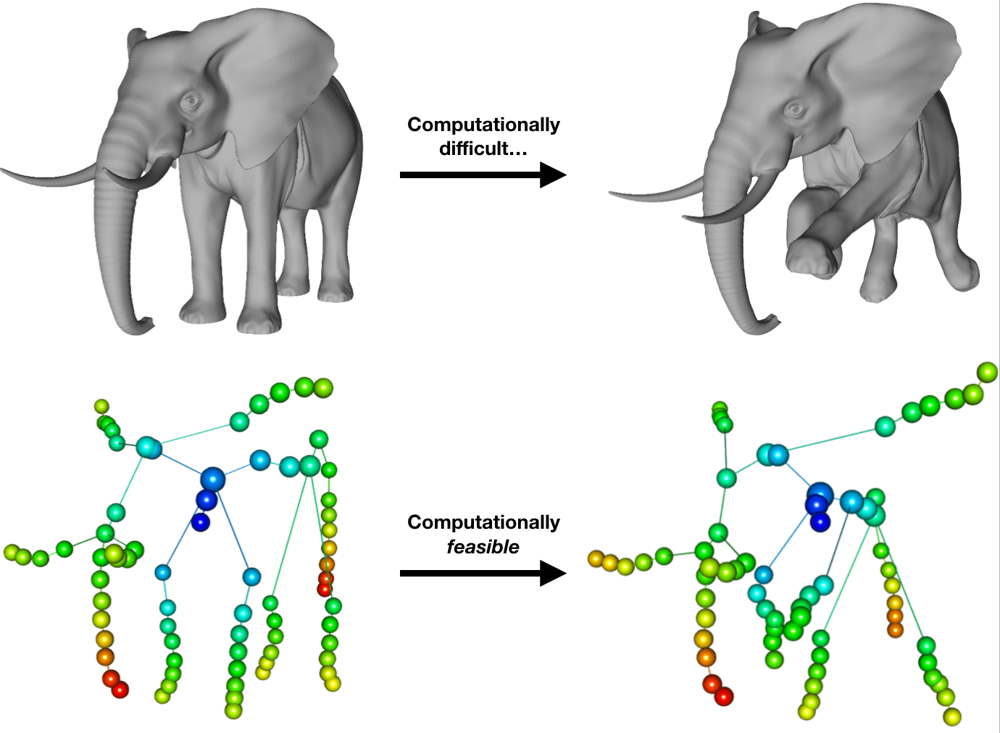

```{r setup_depends, echo=FALSE, eval=TRUE}
if (!requireNamespace("rgl", quietly = TRUE)){ 
  install.packages("rgl", repos = "http://cran.us.r-project.org") 
}
if (!requireNamespace("readobj", quietly = TRUE)){ 
  install.packages("readobj", repos = "http://cran.us.r-project.org") 
}
```

```{r setup, echo=FALSE, results="asis", include=FALSE}
library("Mapper")
knitr::opts_chunk$set(rgl.newwindow = TRUE)
set.seed(123)
options(rgl.useNULL=TRUE)
options(rgl.printRglwidget=FALSE)
library(rgl)
rgl::setupKnitr()
```


This is part of a (planned) multi-part tutorial series demonstrating both the utility and generality of the _Mapper_ method. This vignette describes how one might use the _Mapper_ method to __compare shapes__.  

## Motivation 

One of the central preoccupations of computer vision is understanding how to recognize objects representing semantically 'equivalent' things. In particular, much work has been done on _quantifying_ notions of equivalence between shapes in both _robust_ and _meaningful_ ways. Generally speaking, to formally ascertain whether certain shapes represent the 'same' object, it's necessary to first equip these shapes with some kind of geometric structure. For example, if the object comes in the form of point cloud data, a typical approach is to equip these shapes with a distance metric and view them as _metric spaces_. 

<!-- For many computer vision tasks, e.g. [pose estimation](https://en.wikipedia.org/wiki/3D_pose_estimation), it's not enough to  -->

<!-- this notion of being _meaningful_ is to define notion of similarity between shapes meaningful, but such notions also exhibit invariance to certain deformations and or poses of the objects represented by those shapes. -->
<!-- Similar problems arise in other scientific disciplines, e.g. medical imaging, computer vision, molecular biology, etc. -->

<!-- In Clusteirng, theres 2 steps, defining the metric, and then defining the linkage criteria. The former is often thought to express the meaning (what does it mean for two objects to be 'similar'?), and the latter expresses the meaning for two groups to be similar.   -->

<!-- Indeed, [Gunnar Carlsson](https://www.youtube.com/watch?v=XfWibrh6stw) explains topological data analysis (TDA) by connecting the idea that data has shape, and   as an expression of modeling generic data as shape.  -->

<!-- its necessary to define some notion of invariance with which to consider objects in the group equivalent -->

<!-- For example, in order to perform [hierarchical cluster analysis](https://en.wikipedia.org/wiki/Hierarchical_clustering), one generally needs just two ingredients: a _distance measure_ and a _linkage criteria_. Equivalently, one needs to define both a measure of (dis)similarity between both _points_ and _groups of points_. Ideally, both definitions ought to be _meaningful_ with respect to the domain of interest.  -->

<!-- 'cluster' one generally needs to define a distance function which expresses some intrinsic measure of dissimilarity between objects.  -->

<!-- Analogously, [Wikipedia defines topology](https://en.wikipedia.org/wiki/Topology) as a field "concerned with the properties of a geometric object that are preserved under continuous deformations." -->

Recall that a metric space is a pair $(d, X)$ where $X$ is a set equipped with a function $d: X \times X \to \mathbb{R}$ which expresses the some measure of distance between points. To qualify as a true metric, for any points $x, x', x'' \in X$, $d$ must satisfy: 

1. $d(x, x') \geq 0, d(x, x') = 0$ iff $x = x'$ (non-negativity, identity)
2. $d(x, x') = d(x', x)$ (symmetry)
3. $d(x, x') + d(x', x'') \geq d(x, x'')$ (triangle-equality)

The conditions satisfied by a metric express intuitive notions of distance in an element-wise manner. However, if one wishes to compare _groups_ of elements, a convenient and natural extension to a metric is the _Hausdorff distance_.

<!-- A well-studied problem from computer vision for matching shapes is known [point cloud registration](https://en.wikipedia.org/wiki/Point_set_registration), i.e. the process of finding a transformation that 'aligns' two point clouds. A classical algorithm for determining the transformation that aligns two _rigid_ point cloud is the [Iterative Closest Point](https://en.wikipedia.org/wiki/Iterative_closest_point) (ICP) method. -->

## Hausdorff distance

The Hausdorff distance measures how far apart _subsets_ of a metric space are from each other; that is, given two non-empty subsets $X, Y$ of some common metric space $(Z, d_Z)$, it expresses the maximum distance a set is from the nearest point in the other set. The typical definition of the 'directed' Hausdorff distance is:

\begin{equation}\tag{1}
d_{DH}(X, Y) = \sup_{x \in X}\inf_{y \in Y} d_Z(x, y)
\end{equation}

The above distance is not symmetric (hence the 'directed' designation) and extension to $d_Z$ does not result in a not a true metric. We can generalize $d_{DH}$ by taking the maximum directed Hausdorff distance between $X$ and $Y$ and $Y$ and $X$:

\begin{equation}\tag{2}
d_{H}(X, Y) = \max \{ \, d_{DH}(X,Y), \,d_{DH}(Y,X) \, \}
\end{equation}

[It can be shown](#ref1) that this symmetric Hausdorff distance _is_ in fact a metric on the space of compact subsets of $Z$. This nice property of the Hausdorff distance enables a convenient and natural extension of any metric $d_Z$ to be defined between subsets of $Z$.

Intuitively, the Hausdorff distance provides very convenient distance measure for the _mapper_ construction. Since each node in a _mapper_ represents a subset of the data, if the space the _mapper_ nodes were constructed on was a metric space, the Hausdorff distance can be used to *embed* the _mapper_ into a metric space. 

<!-- Intuitively, although Mapper provides a means of extracting a _topological_ summary of a given data set, it can also be used to the summarize _geometric_ information (i.e. distance information) about the data as well!  -->

To illustrate this idea, I'm going to borrow some high-fidelity [pose](https://en.wikipedia.org/wiki/Pose_(computer_vision)) data sets from [this source](http://people.csail.mit.edu/sumner/research/deftransfer/data.html)

```{r, echo=TRUE, eval=FALSE}
target_dir <- tempdir()
target_file <- file.path(target_dir, "elephant-poses.tgz")
pose_db <- "http://people.csail.mit.edu/sumner/research/deftransfer/data"
if (!file.exists(target_file)){
  download.file(file.path(pose_db, "elephant-poses.tgz"), destfile = target_file)
  if (!dir.exists(file.path(target_dir, "elephant-poses"))){
    untar(tarfile = target_file, exdir = target_dir)
  }
}
```

```{r, echo=FALSE, eval=TRUE}
target_dir <- normalizePath("~/Downloads")
target_file <- file.path(target_dir, "elephant-poses.tgz")
```

As evident from the name of the file, the set of poses downloaded above are meshes of an elephant in different running poses. Here I'll use the [readobj](https://cran.r-project.org/web/packages/readobj/index.html) and [rgl](https://cran.r-project.org/web/packages/rgl/index.html) packages to view what the meshes look like. 

```{r mesh_vis, eval=TRUE}
library("readobj")
el_ref_fn <- normalizePath(file.path(target_dir, "elephant-poses", "elephant-reference.obj"))
el_ref <- readobj::read.obj(el_ref_fn)
shade3d(readobj::tinyobj2shapelist3d(el_ref), color = "gray")
rglwidget()
```

This is decidedly a high-fidelity mesh. 

```{r}
## Extract coordinates and simplices 
xyz <- t(el_ref$shapes[[1]]$positions)
tri <- t(el_ref$shapes[[1]]$indices)

dim(xyz)
dim(tri)
```
At $42$k points and $84$k triangles, the size of the data set as is makes it a little inconvenient to work with; it's preferable to get a sampling and instead work with a reduced set. There are many ways of sampling from a mesh (e.g. uniform sampling). Ideally, however, the subset of points should preserve the major aspects of the shape, i.e. if no points from the tusk of the elephant were in the reduced data set, it might not look like an elephant any more! 

A common procedure to extract a subset of points, or _landmarks_, is the well-known *maxmin* landmark procedure, introduced in [this paper](#ref2). *maxmin* is an greedy procedure for picking landmarks that are evenly spread about a point cloud. The procedure, summarized from section 2.3 of [the paper](#ref2), is as follows: Let $X$ denote the point cloud, $L$ denote the set of landmarks (empty at first) and $n$ the number of landmarks requested. Pick a random point $x \in X$ to act as the first landmark $l_1$. Inductively, if $l_1, l_2, \dots, l_{i-1}$, choose the next landmark $l_i \in X \setminus \{ l_1, l_2, \dots, l_{i-1} \}$ be the data point that minimizes: 

\begin{equation}\tag{3}
\underset{x}{\mathrm{argmax}} \, f(x) = \min\{ d(x, l_1), d(x, l_2), \dots, d(x, l_{i-1})\}
\end{equation}

The _Mapper_ package has a fast C++ implementation of this procedure, which returns the indices of the points chosen as landmarks. Here's code to pick 4000 landmarks from the elephant mesh:
```{r landmark_cache, echo=FALSE, eval=TRUE}
landmark_idx <- readRDS("landmarks.rds")
```
```{r landmark_calc, echo=TRUE, eval=FALSE}
landmark_idx <- landmarks(xyz, n = 4000)
```

The resulting landmarks chosen by *maxmin*: 

```{r landmark_vis}
rgl::plot3d(xyz[landmark_idx,], col ="gray", xlab="",ylab="",zlab="",axes=FALSE)
rglwidget()
```

Indeed, sampling by *maxmin* seems to capture the shape of the elephant mesh quite evenly.  

Given the data set has been reduced, next is to define a filter function. In this scenario, we want to preserve some of the geometric aspects of the shape. A common filter for this kind of task is the so-called _eccentricity function_. It is defined as follows: 

\begin{equation}\tag{4}
	\mathrm{Ecc}(x) = \Bigg(\frac{\sum_{x_i \in X} d(x, x_i)^p}{n}\Bigg)^{\frac{1}{p}}
\end{equation}

for $1 \leq p \leq \infty$.  One of the often-mentioned benefits of the eccentricity function is that one need not have a center (or centers) explicitly available, as the function is defined purely in terms of distances (with the norm depending on $p$). Like many functions often chosen as filters for Mapper, the eccentricity of a data set is also coordinate-independent in the sense that it is invariant under data rotations or translations. 

Say we color the elephant with such an eccentricity function (with $d$ as the euclidean metric): 
```{r ecc_vis_1}
shape_ecc <- sqrt(rowMeans(as.matrix(dist(xyz[landmark_idx,]))))
rgl::plot3d(xyz[landmark_idx,], xlab="",ylab="",zlab="",axes=FALSE,
            col=bin_color(shape_ecc))
rglwidget()
```
With this shape, one can clearly see that many features should indeed cluster well in the Mapper. For example, the points along the tusks will have very high filter values (and so are likely to be in the same open set in the cover) and are also quite separated in the ambient space, so if the clustering heuristic works, it's a good bet that they'll be recovered as two separate nodes in the _mapper_.

However, the direct euclidean eccentricity of the _point cloud_ alone doesn't preserve any of the connectivity/mesh information. Notice that e.g. the back feet have different distances than the front feet, and that very tip of the trunk has a lower distance than the points in the trunk next to it. Additionally, the ears of the elephant change quite rapidly. The filter values effectively just represent the straight-line distance of every point to the center of mass of the elephant.

Instead, an alternative to use the shortest path, or _geodesic_ distance as our metric input to the eccentricity function. Calculating the shortest-path between all pairs of points is a well-known problem that can be solved via e.g. the [Floyd-Warshall algorithm](https://en.wikipedia.org/wiki/Floyd%E2%80%93Warshall_algorithm). I use an implementation of said algorithm in [igraph](https://igraph.org/r/) here:
```{r ecc_cache, echo=FALSE, eval=TRUE}
shape_ecc <- readRDS("shape_ecc.rds")
```

```{r ecc_calc, echo=TRUE, eval=FALSE}
## Input the mesh
st <- simplextree::simplex_tree()
st$insert(as.list(as.data.frame(t(tri))))

## Calculate edge weights
edges <- st$edges+1L ## convert to 1-based 
edge_dist <- proxy::dist(x=xyz[edges[,1],], y=xyz[edges[,2],], pairwise=TRUE)

## Get the shortest path distance along the mesh
g <- igraph::graph_from_edgelist(edges, directed=FALSE)
surface_dist <- igraph::distances(g, v=landmark_idx, to=landmark_idx, weights=edge_dist)

## Calculate the eccentricity for p=2
shape_ecc <- sqrt(rowMeans(surface_dist))
```

The point cloud with the geodesic-adjusted eccentricity looks as follows:   
```{r ecc_vis_2}
rgl::plot3d(xyz[landmark_idx,], col=bin_color(shape_ecc), xlab="",ylab="",zlab="",axes=FALSE)
rglwidget()
```

With both the data and filters defined, let's see what the _mapper_ construction looks like. 
```{r mapper_vis_1}
m <- MapperRef$new()
m$use_data(xyz[landmark_idx,])
m$use_filter(shape_ecc)
m$use_cover("fixed interval", number_intervals = 15, percent_overlap = 40)
m$construct_k_skeleton()

## Plot 
library(pixiplex)
plot(m$as_pixiplex()) %>% enableForce()
```

Can you pick out which subgraphs of the _mapper_ map back to which parts of the elephant? 

It should be straightforward, however it would be nice if the _mapper_ itself was embedded in a metric space. And with this data set, the ambient space is 3-dimensional, so that space can be visualized easily. 

Since each node represents a subset of the data, and the connected components of _mapper_ itself were clustered with the (default) $\ell_2$ metric, we can get a metric on the mapper by computing the hausdorff distance between the subsets of the data each node of the _mapper_ corresponds to. The `Mapper` package has a smooth approximation of the Hausdorff distance for the task. 

```{r, cache=TRUE}
dh <- Mapper::hausdorff_distance(m)
```

To get a coordinization, one can use e.g. [multidimensional scaling](https://en.wikipedia.org/wiki/Multidimensional_scaling):

```{r, cache=TRUE}
dh_xyz <- cmdscale(dh, k = 3)
```

To get a visualization that preserves the adjacency information, I'll once again let the `igraph` and `rgl` packages do the heavy lifting: 
```{r mapper_vis_2, cache=TRUE}
rgl::clear3d()
igraph::rglplot(m$as_igraph(), layout=dh_xyz, vertex.label=NA)
rglwidget(reuse = FALSE)
```


## Gromov-Hausdorff distance

The Hausdorff distance provides a simple and convenient mechanism for measuring the distance between subsets of points in a metric space. And as shown above, it's can be used to create a distance metric on the set of subsets of a metric space. However, it may be the case one want might want to compare geometric structures which are not already embedded in a common metric space. The _Gromov-Hausdorff_ (GH) distance, which has been discussed more extensively in e.g. [this paper](#ref5), is a very natural measure for such a task. The GH distance between two metric spaces $X$ and $Y$ is defined as:

\begin{equation}\tag{5}
d_{GH}(X, Y) = \inf_{Z, f, g}\big\{ d_{H}(\, f(X), \,g(Y) \,)\big\}
\end{equation}

where $d_H$ is the _Hausdorff_ distance, defined above, and $f$ and $g$ are maps that take $X$ and $Y$ to some metric space, $Z$. The GH distance can also be interpreted as measuring the [additive distortion](#ref3) suffered when mapping one metric space to another via a correspondence between their points.

To see why GH-distance is a _natural_ measure in some sense, consider just a few of the properties satisfied by $d_{GH}$. Let $(d_X, X)$, $(d_Y, Y)$, $(d_Z, Z)$ be metric spaces, then:

1. If $d_{GH}(X, Y) = 0$, then $(d_X, X)$ and $(d_Y, Y)$ are _isometric_.

2. If $\mathbb{X}$ is a compact metric space and $X \subset \mathbb{X}$, then $d_{GH}(\mathbb{X}, X) \leq d_H(\mathbb{X}, X)$

3. $d_{GH}(X, Y) + d_{GH}(Y, Z) \geq d_{GH}(X, Z)$

The first property formalizes what it means for the GH distance to describe when two metric spaces are _isometric_ to each other, whereby two metric spaces $(M_1, \rho_1)$, $(M_2, \rho_2)$ are said to be _isometric_ if there exists a bijection $\phi: M_1 \to M_2$ that preserves distances, i.e. $\rho_1(a, b) = \rho_2(\phi(a), \phi(b))$ for any $a,b \in M_1$. 

The second property has a nice intuitive interpretation: roughly speaking, the GH distance between e.g. $M_1, M_2$ is the _minimum_ hausdorff distance among all isometric embeddings of $M_1, M_2$. 

The third property indeed justifies the GH distance a reasonable framework for shape comparison. In practice, the triangle inquality is a desirable property for point-wise metrics that describe (dis)similarity. And with the symmetric Hausdorff distance, it it preserved between compact subsets of a metric space. The GH distance preserves this as well, but now in the space of isometric embeddings of metric spaces.

One application of GH distance is the matching of objects up to some notion of invariance, wherein the choice of metric endowed on the objects _defines_ the type of invariance that is desired. For example, if the invariance desired is with respect to _rigid isometries_, one may prefer the euclidean metric, whereas if one prefer the invariance to respect e.g. "bends", a geodesic-type distance may be more preferable. For more explanation on this, see [these slides](#ref4) by Facundo Mémoli.
 
## Detour: Quadratic Assignment Problem

Unfortunately, computing the GH distance is essentially intractable. The fully general version reduces to the [quadratic assignment problem](https://en.wikipedia.org/wiki/Quadratic_assignment_problem) (QAP), which is NP-hard. To see how this reformulation reduces to QAP, consider the following description of the GH-distance. 

First, consider the following definition of Hausdorff distance. Again let $(Z, d)$ be a compact metric space and $\mathcal{C}(Z)$ the collection of all compact sets in $Z$. If $X, Y \in \mathcal{C}(Z)$, the Hausdorff distance between $X$ and $Y$ can be expressed as: 

\begin{equation}\tag{6}
d_H(X, Y) = \inf_{R \in \mathcal{R}(X, Y)} \sup_{(x, y) \in R} d(x, y)
\end{equation}

where $\mathcal{R}(X, Y)$ is the set of [correspondences](#ref6) between $X$ and $Y$. It's been shown that the GH-distance can be expressed as: 

\begin{equation}\tag{7}
d_{GH}(X, Y) = \frac{1}{2} \inf_{R \in \mathcal{R}(X, Y)} \sup_{\substack{x,x' \in X \\ y,y' \in Y \\ (x,y),(x',y') \in R}} \Gamma_{X, Y}(x,y,x',y')
\end{equation}

where $\Gamma_{X, Y}(x,y,x',y') = \lvert d_X(x, x') - d_Y(y,y') \rvert$. Using this kind of interpretation, we can express the GH distance more discretely. Let $X = \{x_1, x_2, \dots, x_n\}$ and $Y = \{y_1, y_2, \dots, y_m\}$ be finite metric spaces. For any correspondence $R \in \mathcal{R}(X, Y)$ let $\mu_{ij}$ equal $1$ if $(i,j) \in R$ and $0$ otherwise. Then the GH distance can be expressed as: 

\begin{equation}\tag{8}
d_{GH}(X, Y) = \frac{1}{2} \min_{R} \max_{i,j,k,l} \Gamma_{ik \, jl} \mu_{ij} \mu_{kl}
\end{equation}

where $\Gamma_{ik\,jl} = \lvert d_X(x_i, x_k) - d_Y(y_j,y_l) \rvert$, $\mu_{ij} \in \{0, 1\}$. When $n = m$, _this_ expression should make the connection to QAP clear (and if not, seek __Remark 3__ in [this paper](#ref7)). 

## Gromov-Hausdorff => Gromov-Wasserstein

Although the GH distance may be NP-hard in the general case, it's natural to consider relaxations by e.g. considering shapes as more than just sets of points equipped with a metric. This is true for the Hausdorff distance as well: it's [common](#ref9) for practical applications to relax $d_H$ to the Wasserstein distance, which can also be interpreted in terms of the [optimal transport problem](https://en.wikipedia.org/wiki/Transportation_theory_(mathematics)). In a series of analyses, Mémoli studied various different equivalent expressions of the GH distance towards obtaining a transport-based relaxation see any of the references [5](#ref5), [7](#ref7), or [8](#ref8). 

To define this relaxation, instead of interpreting shapes as metric spaces, say we assume a _probability measure_ is given on the set of points, such that now such shapes are interpreted as _measure-metric spaces_, i.e. a triple $(X, d_X, \mu_X)$ where:

1. $(X, d_X)$ is a compact metric space 
2. $\mu_X$ is a Borel probability measure on $X$, i.e. $\mu_X(X) = 1$

Under the measure-metric space setting, the GH distance relaxes to the so-called Gromov-Wasserstein (GW) distance. For $1 \leq p < \infty$, the GW distance is defined as:

\begin{equation}\tag{9}
D_{p}(X, Y)=\frac{1}{2} \inf _{\mu \in \mathcal{M}\left(\mu_{X}, \mu_{Y}\right)}\left(\int_{X \times Y} \int_{X \times Y}\left(\Gamma_{X, Y}\left(x, y, x^{\prime}, y^{\prime}\right)\right)^{p} \mu(d x \times d y) \mu\left(d x^{\prime} \times d y^{\prime}\right)\right)^{1 / p}
\end{equation}

or when $p = \infty$

\begin{equation}\tag{10}
D_{\infty}(X, Y) = \frac{1}{2} \inf_{\mu \in \mathcal{M}(\mu_X, \mu_Y)} \sup_{\substack{x,x' \in X \\ y,y' \in Y \\ (x,y),(x',y') \in \mathrm{supp}(\mu)}} \Gamma_{X,Y}(x,y,x',y')
\end{equation}

From the practical setting of comparing shapes, the probability measure $\mu_X$ can be interpreted as indicating the importance of the difference between specific points in the data set.
To express this relaxation in terms of the QAP notation, take equation 7 and replace the notion of a *correspondence* with a *coupling measure* $\mathcal{M}(\mu_X, \mu_Y)$, and replace the $\max$'s with $L_p$ norms. One obtains: 

\begin{equation}\tag{11}
D_{p}(X, Y)=\frac{1}{2} \min _{\mu \in \mathbb{R}^{n \times m}}\left(\sum_{i, i^{\prime}=1}^{n} \sum_{j, j^{\prime}=1}^{m} \mu_{i j} \mu_{i^{\prime} j^{\prime}} \Gamma_{i j, i^{\prime} j^{\prime}}^{p}\right)^{1 / p} \text { subject to } 0 \leq \mu_{i j} \leq 1, \sum_{i=1}^{n} \mu_{i j}=\lambda_{j}, \sum_{j=1}^{m} \mu_{i j}=\nu_{i}
\end{equation}

where $\mu(x_i) = \nu_i$, $\mu_Y(y_j) = \lambda_j$. 

In [this paper](#ref7), Mémoli introduced a number of bounds and computational techniques attempting to enable this relaxation to be computed in practical settings. In particular, minimizing the $L_p$ version of the GW distance between two point clouds reduces to a non-convex [quadratic optimization problem](https://en.wikipedia.org/wiki/Quadratic_programming) (QOP) w/ linear constraints. Additionally, three lower bounds were shown, all of which can be recast as linear optimization problems. 

The Mapper package provides a simple interface to setting up either the LOP (for the lower bound) or the QOP (for the global) using the [R Optimization Infrastructure](http://roi.r-forge.r-project.org/) (ROI). The former requires any ROI plugin package (e.g. [lpsolve](https://cran.r-project.org/web/packages/ROI.plugin.lpsolve/index.html)) that can solve a linear program. Since the QOP is non-convex, the latter optimization is just recast the problem as a general nonlinear optimization problem (since, as far as I can tell, there is no ROI plugin as well-suited to this problem as e.g. the  [QUADPROG](https://yalmip.github.io/solver/quadprogbb/) or [QUADPROBB](https://github.com/sburer/QuadProgBBoptimizer) optimizers in YALMIP). 
As a result, the current implementation encodes the constraints as penalties into an augmented lagrangian based approach using [nloptr](https://cran.r-project.org/web/packages/nloptr/index.html). 

The function to compute the GW-distance is called [gromov_hausdorff](https://peekxc.github.io/Mapper/reference/gromov_hausdorff.html) (see `?gromov_hausdorff` for more details). It requires as its arguments:

1) either a `dist` object or a distance matrix, for two point clouds $X$ and $Y$
2) a vector representing $\mu_X$ and $\mu_Y$, respectively

By default, only the lower bound is computed, and the results returned include the computed distance, the matching measure found $\mu^\ast$, and the set of correspondences betwen $X$ and $Y$, returned as surjective mapping from $X$ to $Y$ and vice versa.

## Back to Mapper 

How does this all relate back to _Mapper_? Computing the GW distance requires solving for $(n \times m)$ variables and $(n + m)$ constraints. Since the optimization is a non-convex QOP, finding the global solution is NP-hard. Solving for the lower-bound is much more feasible---LOP solvers are comparatively quite fast. However, for sufficiently large point clouds like the 4k _reduced_ set above, this still qualifies as a _large-scale_ optimization (~1.6M variables to solve for each pair of shapes!). 

Instead of comparing point clouds, why not compare _Mappers_? Since _Mapper_ provides a simplified representation of its input (like the elephant), it's worth considering whether it would suffice to compute the GW distance between _mappers_ in order to do the shape comparison. That is, to summarize:

```{r, echo=FALSE}

```


```{r, echo=FALSE, eval=FALSE}
# ## Choose any two poses
# pose1 <- "elephant-reference.obj"
# pose2 <- "elephant-01.obj"
# 
# ## Use multidimensional scaling on the hausdorff distances of their mappers
# pose1_xyz <- cmdscale(shape_hd[[ pose1 ]], k = 3)
# pose2_xyz <- cmdscale(shape_hd[[ pose2 ]], k = 3)
# 
# ## Translate one 
# pose2_xyz[,1] <- pose2_xyz[,1] + diff(range(pose2_xyz[,1]))*5
# 
# rgl::clear3d()
# igraph::rglplot(shape_mappers[[ pose1 ]]$as_igraph(), layout=pose1_xyz, vertex.label=NA)
# igraph::rglplot(shape_mappers[[ pose2 ]]$as_igraph(), layout=pose2_xyz, vertex.label=NA, add=TRUE)
# rglwidget()
```

Let's test this theory out. There are 7 different animals provided in the data set from [the original webpage](http://people.csail.mit.edu/sumner/research/deftransfer/data.html), with each animal having about ~10 different poses, +1 'reference' pose where the animal is just standing. In total, there are 73 meshes of different animal poses, which requires 2628 GW minimizations. After repeating the entire process above, I computed the _lower bound_ of the GW-distance between each pair of distance matrices $d_H$ extracted from the _mappers_. To set $\mu_X$ and $\mu_Y$, I used a the number of points within each vertex as a proxy weight for the 'importance' of the point. The (pseudo)-code looks something like: 

```{r, eval=FALSE, echo=TRUE}
## Load precomputed information
base_path <- "~/mapper" # path containing precomputed information
shapes <- readRDS(file = file.path(base_path, "all_shapes.rds"))
shape_lm <- readRDS(file = file.path(base_path, "shape_lm.rds"))
shape_mesh <- readRDS(file = file.path(base_path, "shape_mesh.rds"))
shape_ecc <- readRDS(file = file.path(base_path, "shape_ecc.rds"))
n_shapes <- length(shapes)

## Compute mappers 
shape_mappers <- pbapply::pblapply(seq(length(shapes)), function(i){
  m <- MapperRef$new()
  m$use_data(shapes[[i]][shape_lm[[i]],])
  m$use_filter(matrix(shape_ecc[[i]]))
  m$use_cover("fixed interval", number_intervals=15L, percent_overlap=40)
  m$construct_k_skeleton(k=1)
})
names(shape_mappers) <- names(shapes)

## Compute mapper hausdorff distances  
shape_hd <- pbapply::pblapply(shape_mappers, Mapper::hausdorff_distance)
names(shape_hd) <- names(shapes)

## Compute mapper gromov-wasserstein bounds
library(ROI.plugin.nloptr)
library(ROI.plugin.glpk)
gh_dist <- matrix(0, nrow = n_shapes, ncol = n_shapes)
gh_aux <- vector("list", length = choose(n_shapes, 2)+n_shapes)
for (i in seq(n_shapes)){
  for (j in seq(1, i)){
    { n_pt_x <- sapply(shape_mappers[[i]]$vertices, length); mu_X <- n_pt_x/sum(n_pt_x) }
    { n_pt_y <- sapply(shape_mappers[[j]]$vertices, length); mu_Y <- n_pt_y/sum(n_pt_y) }
    gh_res <- gromov_hausdorff(d_X = shape_hd[[i]], d_Y = shape_hd[[j]], mu_X = mu_X, mu_Y = mu_Y)
    gh_dist[i,j] <- gh_res$gh
    gh_aux[[Position(is.null, gh_aux)]] <- gh_res[c("mu", "correspondences")]
  }
}
```

And the results? 

```{r, eval=FALSE, echo=FALSE}
gh_dh <- readRDS(file="~/mapper/ignore/gh_dh.rds")
gh_dist <- matrix(0, nrow=73, ncol=73)
gh_dist[lower.tri(gh_dist)] <- unlist(sapply(gh_dh, function(x) { x$lop_res$gh }))
gh_mat <- as.matrix(as.dist(gh_dist))

## to get the labels
prefix <- toupper(substring(gsub("(.*)-(\\d+|reference).*", replacement="\\1", x=names(shapes)), first=1L, last=2L))
suffix <- gsub("(.*)-(\\d+|reference).*", replacement = "\\2", x = names(shapes))
suffix[grep(x = suffix, pattern = "reference")] <- "REF"
labels <- paste0(prefix, "-", suffix)

colnames(gh_mat) <- labels
rownames(gh_mat) <- labels
# image(, ylim=c(1, 0), col = viridis::viridis(100),   main = "")

library(ggplot2)
gh_melt <- reshape2::melt(gh_mat)
colnames(gh_melt) <- c("shape_x", "shape_y", "GH")
gh_heatmap <- ggplot(data = gh_melt, mapping = aes(x = shape_x, y = rev(shape_y))) +
  geom_tile(aes(fill = GH), colour = "grey50") +
  scale_x_discrete(labels = labels) +
  scale_y_discrete(labels = rev(labels)) +
  xlab("") + ylab("")+
  ggtitle("Lp Gromov-Wasserstein distance between Mappers", subtitle="(lower bound)") +
  scale_fill_gradientn(colors = viridis::viridis(100)) +
  theme(axis.text.y = element_text(size = 6)) +
  theme(axis.text.x = element_text(angle = 60, hjust = 1, size = 6))
gh_heatmap
```

```{r, echo=FALSE, eval=TRUE}
knitr::include_graphics("gh_shapes_res.png")
```

Aside from a few outliers, we can see that using just the lower bound approximation we get the nice 'blocking' kind of result as shown in [the 2007 paper](3ref7). The first two characters of the labels on the axis' denote the animal (e.g. 'EL' denote elephant, 'CA' denote camel, etc.), and the number denotes the pose its in. Observe the distances between poses from the same animal are darker (lower GW distance). Similarly, observe the head poses ('HE') and the face poses ('FA')---which are the only non-animal shapes in the data set---are very similar to each other and dissimilar to the other shapes. 

Very cool. 

## Conclusion 

That concludes the vignette showing how the _Mapper_ method can be used to __compare shapes__. Of course, this is just one of _many_ possible use cases for the _Mapper_. Stay tuned for more illustrative vignettes demonstrating the generality of the method. Or, if you develop your own use case using this package, feel free to shoot me a [pull request](https://github.com/peekxc/Mapper) so I can show it off in [the documentation showcase!](https://peekxc.github.io/Mapper/articles/extra/community.html).


## References 

<a id="ref1">1.</a>  For background information on Hausdorff distance see e.g. [these slides](http://www.math.harvard.edu/library/sternberg/slides/1180910.pdf)

<a id="ref2">2.</a>  See section 2.3 of: De Silva, Vin, and Gunnar E. Carlsson. "Topological estimation using witness complexes." SPBG 4 (2004): 157-166.

<a id="ref3">3.</a> Agarwal, Pankaj K., et al. "Computing the Gromov-Hausdorff distance for metric trees." ACM Transactions on Algorithms (TALG) 14.2 (2018): 24.

<a id="ref4">4.</a>  Presentation on $L^p$-GH distance by Facundo Mémoli [here](https://people.math.osu.edu/memolitechera.1/talks/dghlp-jun-jul-08.pdf)

<a id="ref5">5.</a>  Mémoli, Facundo, and Guillermo Sapiro. "A theoretical and computational framework for isometry invariant recognition of point cloud data." Foundations of Computational Mathematics 5.3 (2005): 313-347.

<a id="ref6">6.</a> Recall that for sets $A$ and $B$, a subset $R \subset A \times B$ is defined as a correspondence between $A$ and $B$ if every element $a \in A$ is related to at least one element in $B$ and every element $b \in B$ is related to at least one element in $A$.  

<a id="ref7">7.</a> Mémoli, Facundo. "On the use of Gromov-Hausdorff distances for shape comparison." (2007).

<a id="ref8">8.</a> Mémoli, Facundo. "Gromov–Wasserstein distances and the metric approach to object matching." Foundations of computational mathematics 11.4 (2011): 417-487.

<a id="ref9">9.</a> Villani, Cédric. Topics in optimal transportation. No. 58. American Mathematical Soc., 2003.

<a id="ref10">10.</a> Villar, Soledad, et al. "A polynomial-time relaxation of the gromov-hausdorff distance." arXiv preprint arXiv:1610.05214 (2016).

<a id="ref11">11.</a> Sumner, Robert W., and Jovan Popović. "Deformation transfer for triangle meshes." ACM Transactions on graphics (TOG) 23.3 (2004): 399-405.
